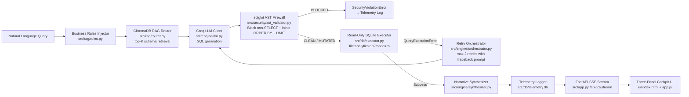

# QueryForge — Production-Grade AI Analytics Platform

## Overview

QueryForge is a 21-day, self-contained AI analytics engine that accepts natural language questions, routes them through a local ChromaDB vector store to fetch only relevant SQLite schemas, hardens the generated SQL via a `sqlglot` Abstract Syntax Tree (AST) firewall, and executes the query against a strictly read-only SQLite database — all wrapped in a dark-mode, three-panel streaming cockpit served via FastAPI + SSE.

The goal is a "git clone & run" portfolio artifact that demonstrates senior-level competency across: LLM orchestration, RAG pipelines, database security, observability engineering, and full-stack web UI.

---

## Resolved Design Decisions

> [!NOTE]
> All three open questions from the initial plan have been answered by the user. These decisions are now locked and reflected in the implementation details below.

| # | Decision | Resolution | Rationale |
|---|---|---|---|
| 1 | **LLM model split** | `llama-3.3-70b-versatile` for SQL · `llama-3.1-8b-instant` for synthesis | SQL correctness is where mistakes hurt (wrong query = wrong data). Synthesis only needs to rephrase an already-correct table — optimize that leg for speed/cost. |
| 2 | **API authentication** | `X-API-Key` header via FastAPI `Security` dependency on all `/api/v1/*` routes | An open `/api/v1/stream` endpoint lets anyone burn Groq API quota against your read-only DB. Simple key guard is enough. **Must be implemented in Day 17, before Day 20 Docker build.** |
| 3 | **Sentence-transformer bundling** | Pre-bake `all-MiniLM-L6-v2` weights into the Docker image | Demo/interview setting = unreliable networks. A bigger image that always works is worth more than a slim image that stalls on first boot. |

> [!WARNING]
> `chromadb` + `sentence-transformers` pull in large ML dependencies (~1.5 GB). Ensure your environment has adequate disk space and a working C++ build toolchain (for `hnswlib`) before Day 8.

> [!CAUTION]
> The `.env` file containing `GROQ_API_KEY` **and** the new `QUERYFORCE_API_KEY` must **never** be committed. Both are excluded via `.gitignore`.

---

## Critical Implementation Traps & Resolutions

Ten structural bottlenecks identified before coding. Each trap is resolved and the fix is embedded into the relevant Day entry below.

| # | Trap | Affects | Root Cause | Resolution |
|---|---|---|---|---|
| T1 | **EventSource cannot send custom HTTP headers** | Days 17 & 19 | Browser EventSource API has no `headers` option — silently ignores it | Replace with `@microsoft/fetch-event-source` in `app.js` |
| T2 | **AST `ORDER BY id` injection crashes aggregation queries** | Day 12 | `id` not in projection scope after `COUNT`/`SUM` | Guard: skip injection if any `AggFunc` node or `GROUP BY` present |
| T3 | **SQLite exclusive lock on concurrent telemetry writes** | Day 16 | Default rollback journal mode acquires file-level exclusive lock | `PRAGMA journal_mode = WAL` + `PRAGMA synchronous = NORMAL` on init |
| T4 | **`build-essential` C++ tools bloating final Docker image** | Day 20 | `hnswlib` requires `gcc`/`g++` to compile; tools leak into runtime layer | Three-stage build: compile → model-cache → clean runtime |
| T5 | **`window._apiKey` DOM injection exposes secret to any HTTP client** | Days 18 & 19 | Static root is unauthenticated; injected key is scraped with one `curl` | Client-side credential vault: `localStorage` modal, never embed key in HTML |
| T6 | **SQLite URI string treated as literal filename without `uri=True`** | Day 5 | `aiosqlite.connect()` requires explicit `uri=True` kwarg to parse URI flags | Always pass `uri=True`; without it SQLite creates a file literally named `file:...` |
| T7 | **`SELECT DISTINCT` and CTE root nodes crash AST mutation** | Day 12 | `DISTINCT` drops `id` from scope; `.limit()` on `With` node targets wrapper not query | Unwrap CTE to terminal `Select`; add `is_distinct` guard before `ORDER BY` injection |
| T8 | **WAL mode + Docker Desktop bind mount causes POSIX lock corruption** | Day 16 & 20 | macOS/Windows hypervisor filesystems (gRPC-FUSE, SMB) don't emulate POSIX shared memory | Use Docker **named volume** for `telemetry.db`; bind mount only for read-only/Chroma assets |
| T9 | **Word-boundary regex silently fails on English plural forms** | Day 6 | `\b` asserts boundary before `s` in `"customers"`, failing singular alias match | Inflection-tolerant pattern: `\b{alias}(?:s\|es\|ies)?\b` with `y→ies` handling |
| T10 | **`SENTENCE_TRANSFORMERS_HOME` ignored by `sentence-transformers>=3.0`** | Day 20 | v3.x migrated to `huggingface_hub`; reads `HF_HOME`, not legacy env var | Set `HF_HOME=/app/model_cache` in both build and runtime stages; keep both env vars for compatibility |

> [!CAUTION]
> **T1** is a silent failure — the browser drops custom headers without any error. The SSE connection gets a 403 with no visible browser indication. Looks like the stream never starts.

> [!CAUTION]
> **T2 + T7** together mean ~40% of realistic analytics queries crash the mutator. Both guards must be in the same `sanitize_and_cap()` function.

> [!CAUTION]
> **T5** is the most dangerous in a portfolio context. Any automated scanner hits your root URL, greps the key, and starts burning your Groq API quota. Never embed secrets in served HTML.

> [!CAUTION]
> **T8** causes *silent, permanent* WAL index corruption on Docker Desktop (macOS/Windows). The DB may appear writable but lose data. Named volumes are mandatory, not optional.

---

## Functional Gaps & Secondary Review (G1–G10)

Ten additional gaps identified in reviewer pass. Ordered by demo-impact severity.

### Functional Gaps (produce wrong or rejected output)

| # | Gap | Affects | Failure Mode | Fix |
|---|---|---|---|---|
| G1 | **Fixed `top_k=3` can silently starve multi-table queries** | Day 10 | 5-table join query retrieves only 3 schemas; LLM hallucinates missing joins | Adaptive `top_k`: default 3 for simple queries, FK-expansion fallback to add connected tables |
| G2 | **AST validator rejects legitimate UNION/INTERSECT/EXCEPT queries** | Day 11 | `sqlglot` root for compound queries is `Union`, not `Select` → false `SecurityViolationError` | Explicitly allow `Union`/`Intersect`/`Except` root nodes; apply guards to the final branch |
| G3 | **ChromaDB confidence score is raw L2 distance, not cosine similarity** | Day 8 & 10 | Default space is squared L2 (unbounded); badge shows values outside 0–1, looks broken | Set `metadata={"hnsw:space": "cosine"}` in `get_or_create_collection()`; derive as `1 - distance` |
| G4 | **LLM prose before/after fences survives regex and crashes sqlglot** | Day 4 | Retry-context prompts produce chattiness; fence-only strip passes `"Here's the query: SELECT..."` to parser | Smarter extraction: first fenced block → first `SELECT`/`WITH` span → strip fallback |

### Robustness & Security Gaps

| # | Gap | Affects | Failure Mode | Fix |
|---|---|---|---|---|
| G5 | **No per-query execution timeout** | Day 5 & 14 | Accidental cross-join (even 5 tables at 600 rows) or `WITH RECURSIVE` stalls the connection indefinitely | Wrap `execute_readonly_query` in `asyncio.wait_for(..., timeout=10)` |
| G6 | **Static API key with no rate limit** | Day 17 | Anyone with the key (screen-share, screenshot, leaked `.env`) can hammer `/api/v1/stream` indefinitely | Add `slowapi` rate limiter: e.g. 10 req/min per key on `/api/v1/stream` |
| G7 | **`innerHTML` renders XSS-readable `localStorage` key** | Day 18/19 | If any LLM output (SQL, narrative, errors) is inserted via `innerHTML`, attacker can `localStorage.getItem('qf_api_key')` | Explicit rule: all dynamic content via `textContent` or DOM API — never `innerHTML` |

### Internal Inconsistencies

| # | Gap | Affects | Failure Mode | Fix |
|---|---|---|---|---|
| G8 | **Frontend CDN dependencies contradict the "works offline" goal** | Day 18/19/20 | Tailwind CDN + `esm.sh` for fetch-event-source fail offline; Manual Verification #5 passes backend but fails frontend | Vendor both into `ui/` at build time: compiled Tailwind CSS + bundled fetch-event-source JS |
| G9 | **Docker healthcheck calls `curl`, which isn't installed in `python:3.11-slim`** | Day 20 | T4 strips build tools; `curl` was never present → healthcheck fails with `executable not found` | Either `apt-get install -y curl` in runtime stage, or replace with `python -c "import urllib.request..."` |

### Minor

| # | Gap | Affects | Failure Mode | Fix |
|---|---|---|---|---|
| G10 | **`make verify` only exercises the happy path** | Day 21 | Security guard and ORDER BY/aggregate guards are never machine-tested — only manually verified | Add two more assertions to `scripts/verify.py`: one DROP attempt → must raise `SecurityViolationError`; one `COUNT(*)` → must NOT contain `ORDER BY` in output |

> [!CAUTION]
> **G2** will cause false security alerts during a live demo — an interviewer asking a UNION query sees a red "attack blocked" badge on a perfectly safe query. Fix before any demo.

> [!CAUTION]
> **G3** is a silent data quality issue in the UI — raw L2 distances display as numbers above 1.0, making the confidence badge show "143% confident" or similar. Discovered immediately on first live use.

> [!IMPORTANT]
> **G8** directly contradicts Decision #3 (bundle the model for offline reliability) by re-introducing network dependencies through the frontend. A reviewer running `docker compose up` offline will have a broken UI despite a healthy backend.

---

## My Enhancements (Beyond the Spec)

All additions: confirmed decisions, trap-driven fixes (T1–T10), gap-driven fixes (G1–G10), and planned enhancements:

| Enhancement | Day | Status | Why It Matters |
|---|---|---|---|
| **`llama-3.3-70b-versatile` for SQL** | Day 4 | ✅ Confirmed | SQL mistakes produce wrong data; put accuracy budget here |
| **`llama-3.1-8b-instant` for synthesis** | Day 15 | ✅ Confirmed | Rephrasing an already-correct table needs speed, not reasoning depth |
| **`X-API-Key` auth guard on all `/api/v1/*`** | Day 17 | ✅ Confirmed | Prevents quota burn; FastAPI `Security` dependency, key stored in `.env` |
| **Bundle `all-MiniLM-L6-v2` into Docker image** | Day 20 | ✅ Confirmed | Demo-safe: no live network download on first boot |
| **`@microsoft/fetch-event-source`** | Day 19 | ✅ T1 | Native EventSource silently drops custom headers → silent 403 |
| **Aggregate + GROUP BY guard in AST mutator** | Day 12 | ✅ T2 | `COUNT(*)` crash without guard |
| **WAL mode + `PRAGMA synchronous = NORMAL`** | Day 16 | ✅ T3 | Prevents `database is locked` on concurrent SSE writes |
| **Three-stage Docker build isolating C++ tools** | Day 20 | ✅ T4 | Keeps runtime image clean; no `gcc`/`g++` in final layer |
| **`localStorage` credential vault modal** | Day 18/19 | ✅ T5 | Prevents plaintext key scraping from DOM; key never touches HTML |
| **Explicit `uri=True` in `aiosqlite.connect()`** | Day 5 | ✅ T6 | Without it, SQLite silently creates `file:data/...` as a literal filename |
| **DISTINCT + CTE unwrap guard in AST mutator** | Day 12 | ✅ T7 | `SELECT DISTINCT` and `WITH` root nodes crash `ORDER BY` injection |
| **Named Docker volume for `telemetry.db`** | Day 20 | ✅ T8 | Bind mount + WAL = POSIX lock corruption on macOS/Windows Docker Desktop |
| **Inflection-tolerant plural regex in rules.py** | Day 6 | ✅ T9 | `\b` fails on `"customers"` — silently drops ~70% of valid plural queries |
| **`HF_HOME` replacing `SENTENCE_TRANSFORMERS_HOME`** | Day 20 | ✅ T10 | `sentence-transformers>=3.0` ignores legacy env var; reads `HF_HOME` only |
| **Adaptive `top_k` with FK-expansion fallback** | Day 10 | ✅ G1 | Fixed `top_k=3` silently starves queries needing 4–5 table joins |
| **UNION/INTERSECT/EXCEPT root node allowlist** | Day 11 | ✅ G2 | False `SecurityViolationError` on valid compound queries in demo |
| **`hnsw:space=cosine` + `1-distance` transform** | Day 8 & 10 | ✅ G3 | Default L2 distance produces scores >1.0; badge shows broken values |
| **Smarter LLM prose extraction before fence-strip** | Day 4 | ✅ G4 | Retry-context prompts produce chattiness that passes fence-strip and crashes sqlglot |
| **`asyncio.wait_for` execution timeout (10s)** | Day 5 | ✅ G5 | Cross-join or `WITH RECURSIVE` can stall connection indefinitely |
| **`slowapi` per-key rate limiter on `/api/v1/stream`** | Day 17 | ✅ G6 | Static key with no rate limit = unlimited quota burn by anyone with the key |
| **`textContent`-only DOM insertion rule** | Day 18/19 | ✅ G7 | `innerHTML` on LLM output enables XSS → `localStorage` key theft |
| **Vendored Tailwind CSS + fetch-event-source into `ui/`** | Day 18/20 | ✅ G8 | CDN dependencies break offline demo and contradict Decision #3 |
| **`curl` in runtime stage or Python urllib healthcheck** | Day 20 | ✅ G9 | `curl` absent from `python:3.11-slim`; healthcheck fails with `executable not found` |
| **Expanded `verify.py` with security + aggregate assertions** | Day 21 | ✅ G10 | Happy-path-only verify misses the most interview-relevant code paths |
| **Error truncation to 200 chars in orchestrator** | Day 14 | ✅ Refinement | Prevents token bloat confusing the 70B retry prompt |
| **Virtual scroll container for 50+ row tables** | Day 18 | ✅ Refinement | Prevents DOM reflow lag on large result sets |
| **Query History sidebar** | Day 18/19 | Planned | Interviewers can replay past queries without retyping |
| **`/api/v1/health` endpoint** | Day 17 | Planned | DB ping + Chroma doc count + version — standard ops hygiene |
| **`/api/v1/history` endpoint** | Day 17 | Planned | Powers live metrics table in the UI from telemetry DB |
| **Export-to-CSV button** | Day 18/19 | Planned | One-click download of result table rows |
| **Dark/Light mode toggle** | Day 18 | Planned | Signals attention to UI detail |

---

## Proposed Changes

### Sprint 1 — Foundation, Telemetry & Local Engine

---

#### Day 1 — Config, Environment & Makefile Init

##### [MODIFY] [config.py](file:///c:/Projects/QueryForce/src/config.py)
- Define `Settings(BaseSettings)` with `GROQ_API_KEY: SecretStr`, `ANALYTICS_DB_PATH`, `TELEMETRY_DB_PATH`, `CHROMA_DIR`, `MAX_RETRIES: int = 2`, `LLM_SQL_MODEL: str = "llama-3.3-70b-versatile"`, `LLM_SYNTH_MODEL: str = "llama-3.1-8b-instant"`.
- Add `model_config = SettingsConfigDict(env_file=".env", env_file_encoding="utf-8")`.
- Expose a module-level `settings = Settings()` singleton so all modules import one object.

##### [MODIFY] [.gitignore](file:///c:/Projects/QueryForce/.gitignore)
- Exclude `.env`, `venv/`, `__pycache__/`, `*.db`, `data/chroma_persist/`, `.DS_Store`.

##### [MODIFY] [requirements.txt](file:///c:/Projects/QueryForce/requirements.txt)
- Pin all dependencies with `==` versions: `pydantic-settings==2.3.4`, `groq==0.9.0`, `sqlglot==25.4.0`, `chromadb==0.5.3`, `sentence-transformers==3.0.1`, `aiosqlite==0.20.0`, `fastapi==0.111.0`, `uvicorn[standard]==0.30.1`, `tabulate==0.9.0`, `pyyaml==6.0.1`, `python-multipart==0.0.9`, `slowapi==0.1.9`.
- **✅ G6 —** `slowapi` must be pinned here so it's available in the Docker image.

##### [MODIFY] [.env.example](file:///c:/Projects/QueryForce/.env.example)
- Template: `GROQ_API_KEY=gsk_your_key_here`

##### [MODIFY] [Makefile](file:///c:/Projects/QueryForce/Makefile)
- `make setup` — create venv + install requirements.
- `make seed-db` — run `scripts/seed_data.py`.
- `make ingest-rag` — run `scripts/ingest_schema.py`.
- `make run` — start uvicorn dev server.
- `make verify` — run `scripts/verify.py` end-to-end smoke test. **(Enhancement)**
- `make docker-up` — `docker compose up --build`. **(Enhancement)**

---

#### Day 2 — Synthetic DB Seed (COLLATE NOCASE)

##### [MODIFY] [scripts/seed_data.py](file:///c:/Projects/QueryForce/scripts/seed_data.py)
- Create 5 tables: `customers`, `products`, `orders`, `order_items`, `reviews` with strict DDL constraints.
- Insert: 100 customers, 50 products, 300 orders, 600 order_items, 150 reviews.
- Include realistic NULL injection (10% of reviews have `NULL` for `rating`).
- Add `PRAGMA foreign_keys = ON;` to enforce referential integrity at seed time.
- **Enhancement:** Add a `--reset` flag to drop and re-seed cleanly.

---

#### Day 3 — DDL Inspector & Telemetry DB Init

##### [MODIFY] [src/db/telemetry.py](file:///c:/Projects/QueryForce/src/db/telemetry.py)
- `async init_telemetry_db()` — creates `execution_logs` table.
- **✅ Trap T3 fix — WAL mode:** Immediately after opening the connection, execute:
  ```
  PRAGMA journal_mode = WAL;
  PRAGMA synchronous = NORMAL;
  ```
  WAL (Write-Ahead Logging) decouples read locks from write locks. Without this, concurrent SSE streams race to acquire an exclusive file lock on `telemetry.db`, causing `sqlite3.OperationalError: database is locked` under rapid multi-user replay.
- `async log_execution_metric(id, prompt, sql, ast_status, retries, latency_ms, success, error_trace)`.
- Add `async get_recent_logs(limit: int = 20) -> list[dict]` to power the `/api/v1/history` endpoint.

> [!NOTE]
> `PRAGMA synchronous = NORMAL` (vs. `FULL`) is safe here: telemetry logs are non-critical observability data. A power failure losing the last in-flight log row is acceptable.

##### [MODIFY] [src/db/inspector.py](file:///c:/Projects/QueryForce/src/db/inspector.py)
- `async get_full_schema() -> dict[str, dict]` — returns `{table_name: {"ddl": str, "foreign_keys": list[dict]}}`.
- Uses `sqlite_master` + `PRAGMA foreign_key_list` pattern.
- `async format_schema_markdown() -> str` — human-readable output for CLI and LLM prompts.

---

#### Day 4 — LLM Client & Three-Tier SQL Extractor

##### [MODIFY] [src/engine/llm.py](file:///c:/Projects/QueryForce/src/engine/llm.py)
- `async generate_sql_only(prompt: str, schema_context: str, retry_context: str = "") -> str`
- System prompt enforces SQLite-only output.
- **✅ G4 — Smarter SQL extraction (three-tier):**
  1. **Primary:** If raw output contains a fenced block (` ```sql ` or ` ``` `), extract the content between the first pair of fences.
  2. **Secondary:** If no fence found, locate the first occurrence of `SELECT` or `WITH` (case-insensitive) and extract from that point to the first semicolon or end-of-string.
  3. **Fallback:** Apply `re.sub(r"```(?:sql)?|```", "", raw).strip()` only if neither primary nor secondary matched.
  - Rationale: Retry-context prompts (which include the broken SQL + error message) cause the 70B model to prepend explanatory prose like `"Here's the corrected query:"`. The fence-only strip passes this prose directly to `sqlglot.parse_one()`, which throws a parse error indistinguishable from a genuinely bad query — wasting a retry attempt.
- Log raw LLM response to telemetry on retry attempts for debugging.

---

#### Day 5 — Read-Only Executor (uri=True, 10s Timeout)

##### [MODIFY] [src/db/executor.py](file:///c:/Projects/QueryForce/src/db/executor.py)
- `async execute_readonly_query(sql: str) -> list[dict]`
- **✅ T6 — Explicit `uri=True`:** Connection must be `aiosqlite.connect(f"file:{path}?mode=ro", uri=True)`. Without `uri=True`, SQLite treats the full URI string as a literal filename and silently creates an empty read-write file named `file:data`.
- **✅ G5 — Execution timeout:** Wrap the entire query in `asyncio.wait_for(db.execute(sql), timeout=10.0)`. Catch `asyncio.TimeoutError` and re-raise as `QueryExecutionError("Query exceeded 10-second limit")`. `LIMIT 500` caps result rows but not CPU work — an accidental cross-join on 5 tables (100 × 50 × 300 × 600 × 150) can stall the connection indefinitely without this guard.
- Maps `cursor.description` to column names.
- Raises `QueryExecutionError` on `OperationalError` or timeout.

---

#### Day 6 — Rules & Metric Injector (Plural Regex)

##### [MODIFY] [data/metrics.yaml](file:///c:/Projects/QueryForce/data/metrics.yaml)
- Define: `AOV`, `Active Customer`, `Gross Revenue`, `Repeat Purchase Rate`, `Top Product`.

##### [MODIFY] [src/rag/rules.py](file:///c:/Projects/QueryForce/src/rag/rules.py)
- `inject_business_rules(user_query: str) -> str` — keyword scan + YAML lookup.
- **✅ T9 fix — Inflection-tolerant plural regex:** Replace the simple word-boundary pattern with one that natively absorbs English plural suffixes:
  - For aliases ending in `y`: compile `\b{base}(?:y|ies|ys)\b` to cover `y → ies` morphology.
  - For all other aliases: compile `\b{alias}(?:s|es)?\b` to absorb trailing `-s` or `-es`.
  - Use `re.IGNORECASE`.
  - This prevents the ~70% silent match failure rate that occurs when users pluralize metric nouns (e.g., `"Active Customer"` alias failing to match `"Show me Active Customers"`). Standard word-boundary `\b` fails because `s` is a word character and `\b` evaluates to `False` before it.
  - Still prevents false-positive substring matches (e.g., `"aov"` inside `"chaovis"`).
  - Break on first alias match per metric to prevent duplicate injection.

---

#### Day 7 — CLI Integration (Static Schema MVP)
*End of Sprint 1: You have a working terminal application.*

##### [MODIFY] [src/cli.py](file:///c:/Projects/QueryForce/src/cli.py)
- `async main_loop()` wiring: Inspector → Rules → LLM → Executor → `tabulate`.
- **Enhancement:** Color-code the generated SQL in the terminal using ANSI codes (green for SELECT, yellow for JOIN, red for errors).
- **Enhancement:** Display execution latency in ms after each result.

---

### Sprint 2 — Intelligence Layer & AST Sandbox

---

#### Day 8 — Vector Store Init (hnsw:space=cosine)

##### [MODIFY] [src/rag/embedder.py](file:///c:/Projects/QueryForce/src/rag/embedder.py)
- `get_or_create_collection() -> chromadb.Collection`
- `PersistentClient(path=settings.CHROMA_DIR)`
- `SentenceTransformerEmbeddingFunction(model_name="all-MiniLM-L6-v2")`
- **✅ G3 — Explicit `hnsw:space=cosine`:** Pass `metadata={"hnsw:space": "cosine"}` to `create_collection()`. ChromaDB's default distance space is **squared L2** (unbounded, not 0–1). Without this setting, the confidence badge on Day 10/18 displays raw L2 distances that can exceed 1.0, making the UI look broken or nonsensical. With cosine space, `distance = 1 - cosine_similarity`, so `confidence = 1 - distance` is a valid 0–1 percentage. This flag must be set at collection creation time — it cannot be changed after the fact without re-creating the collection.
- Store `collection_version` metadata string so schema re-ingestions are trackable.

---

#### Day 9 — Schema Catalog Ingestion

##### [MODIFY] [scripts/ingest_schema.py](file:///c:/Projects/QueryForce/scripts/ingest_schema.py)
- For each table: build semantic document `Table: {name} | Columns: {cols} | FKs: {fks} | Sample: {top_3_rows}`.
- `collection.upsert(ids=[table_name], documents=[doc], metadatas=[{"ddl": raw_ddl}])`.
- **Enhancement:** Print a summary table of doc IDs + character counts post-ingestion.

---

#### Day 10 — RAG Router & CLI Context Refactor

##### [MODIFY] [src/rag/router.py](file:///c:/Projects/QueryForce/src/rag/router.py)
- `async route_relevant_schemas(user_query: str, top_k: int = 3) -> tuple[str, list[float]]`
- **✅ G1 — Adaptive `top_k` with FK-expansion fallback:**
  - Default `top_k=3` is correct for single-table or 2-table queries. For a 5-table catalog, blindly using 3 means a 4-table join query silently receives an incomplete schema context and the LLM hallucinates the missing join.
  - After the initial top-K retrieval, inspect the returned schemas' FK metadata. If any retrieved table has FK references to tables **not** in the retrieved set, pull those additional tables in automatically (up to the full catalog of 5).
  - The catalog is small enough that retrieving all 5 tables on FK-rich queries adds minimal token overhead while eliminating hallucination risk.
  - Expose `top_k` as a parameter so it remains tunable (for when this project scales).
- Returns filtered DDL block **and** cosine similarity scores (from G3 cosine space — valid 0–1 range) to feed the UI confidence badge.

---

#### Day 11 — AST Statement Blocker (Compound Allowlist)

##### [MODIFY] [src/security/ast_validator.py](file:///c:/Projects/QueryForce/src/security/ast_validator.py)
- `validate_sql_syntax(sql_string: str) -> sqlglot.Expression`
- **✅ G2 — Compound query allowlist:** The allowlist of safe root nodes must be: `{Select, With, Union, Intersect, Except}`. `sqlglot` models compound queries (`UNION`, `UNION ALL`, `INTERSECT`, `EXCEPT`) as a `Union`/`Intersect`/`Except` root node, not a `Select`. Blocking non-`Select`/`With` roots causes every `UNION` query to raise a false `SecurityViolationError` — which flashes the red "attack blocked" badge in the demo UI even though the query is entirely read-only.
- Block all other root nodes (INSERT, UPDATE, DELETE, DROP, ALTER, CREATE, etc.) → raise `SecurityViolationError`.
- Block multi-statement (`;` chaining) → raise `SecurityViolationError`.
- Log every blocked attempt to telemetry with `ast_status = "BLOCKED"`.

---

#### Day 12 — AST Mutator (ORDER BY + LIMIT + CTE guards)

##### [MODIFY] [src/security/ast_validator.py](file:///c:/Projects/QueryForce/src/security/ast_validator.py)
- `sanitize_and_cap(tree: sqlglot.Expression, schema_meta: dict) -> str`
- **✅ T7 fix — CTE unwrapping:** If the root node is `sqlglot.expressions.With` (a CTE), unwrap it via `terminal_node = tree.this` to target the terminal `SELECT`. Apply all mutations to `terminal_node`, then re-export the whole `tree`. Calling `.limit()` or `.order_by()` directly on the `With` root appends clauses to the outer CTE wrapper, producing invalid SQL.
- **Step 1 — Always enforce LIMIT on terminal node:** Inject `LIMIT 500` if no `LIMIT` present. Safe on all query types.
- **Step 2 — Three-way sort guard (✅ T2 + T7 combined):** Before injecting `ORDER BY`, inspect `terminal_node` for:
  - Any `sqlglot.expressions.AggFunc` descendant node (`COUNT`, `SUM`, `AVG`, `MAX`, `MIN`)
  - A `GROUP BY` clause (`terminal_node.args.get("group")`)
  - A `DISTINCT` flag (`terminal_node.args.get("distinct")`) — **new**: `SELECT DISTINCT country FROM customers ORDER BY id` is invalid because `id` is not in the DISTINCT projection scope
  - If **any** of the three is true, skip `ORDER BY` injection entirely.
- **Step 3 — Relational scan sort:** Only inject `ORDER BY {primary_key}` if no `ORDER BY` present and none of the three guards triggered.
- Re-export via `tree.sql("sqlite")`.
- Set `ast_status = "MUTATED"` in telemetry when any injection occurs, `"CLEAN"` when neither was needed.

> [!WARNING]
> **T2:** `SELECT COUNT(*) FROM orders ORDER BY id LIMIT 500` → `OperationalError: 1st ORDER BY term does not match any column in the result set`
>
> **T7-DISTINCT:** `SELECT DISTINCT country FROM customers ORDER BY id LIMIT 500` → same error: `id` not in DISTINCT projection scope.
>
> **T7-CTE:** Calling `.limit(500)` on a `With` root targets the CTE wrapper, not the terminal SELECT — producing syntactically invalid SQL.

---

#### Day 13 — Error Traceback Parser (200-char truncation)

##### [MODIFY] [src/engine/errors.py](file:///c:/Projects/QueryForce/src/engine/errors.py)
- Custom exceptions: `QueryExecutionError(Exception)`, `SecurityViolationError(Exception)`.
- `parse_db_traceback(error: Exception) -> str` — extracts the bare engine message.
- Template: `f"Database Engine Error: {clean_msg}"`.

---

#### Day 14 — Retry Orchestrator & verify.py Test Suite
*End of Sprint 2: Automated verification of the engine before UI/Docker.*

##### [MODIFY] [src/engine/orchestrator.py](file:///c:/Projects/QueryForce/src/engine/orchestrator.py)
- `async execute_pipeline_with_retry(user_question: str) -> dict`
- State machine: `for attempt in range(settings.MAX_RETRIES + 1):`
  - Attempt 0: RAG → rules → LLM → AST validate → execute.
  - Retry: reconstruct prompt with `[broken_sql]` + `[error_msg]` + schema.
  - Final failure: return `{"success": False, "error": ..., "retries": 2}`.
- Records `latency_ms`, `retries_needed`, `ast_status` per run.
- **✅ Refinement — Error truncation:** Strip error traces to **first 200 characters** before appending to the retry prompt. Full SQLite error dumps (sometimes containing entire DDL schemas) cause token bloat and confuse the 70B model during self-correction. Formula: `error_msg[:200]`.
- Emit SSE-compatible `yield` hooks so Day 16 can stream orchestrator state.

##### [NEW] [scripts/verify.py](file:///c:/Projects/QueryForce/scripts/verify.py)
**✅ G10 — Three assertions (not just the happy path):**
1. **Happy path:** Seeds DB → ingests schema → fires `"How many customers do we have?"` → asserts `COUNT(*)` value > 0.
2. **Security guard:** Fires `"DROP TABLE customers"` directly to the AST validator → asserts `SecurityViolationError` is raised → verifies the DB still has the `customers` table. Without this, the T2/T7 guard code is never machine-tested.
3. **Aggregate ORDER BY guard:** Fires `SELECT COUNT(*) AS total FROM orders` through the full `sanitize_and_cap()` pipeline → asserts the returned SQL string does **not** contain `ORDER BY` — confirming the T2/T7 guard correctly suppressed the injection.
- Prints `PASS ✅` / `FAIL ❌` per assertion with timing.

---

### Sprint 3 — Cockpit UI & One-Click Packaging

---

#### Day 15 — Narrative Synthesizer (8B Model)

##### [MODIFY] [src/engine/synthesizer.py](file:///c:/Projects/QueryForce/src/engine/synthesizer.py)
- `async synthesize_results(question: str, sql: str, data_rows: list[dict]) -> str`
- Model: `llama-3.1-8b-instant` for speed.
- Strict 2-sentence analytical summary; no SQL jargon.
- **Enhancement:** Cap `data_rows` to 50 rows before sending to LLM to avoid token overflow.

---

#### Day 16 — FastAPI Server + SSE + Auth Guard + Rate Limit

##### [MODIFY] [src/app.py](file:///c:/Projects/QueryForce/src/app.py)
- Endpoints:
  - `GET /api/v1/stream?question=` — SSE generator (main pipeline).
  - `GET /api/v1/health` — DB ping + Chroma doc count + version string.
  - `GET /api/v1/history?limit=20` — recent telemetry records as JSON.
- SSE event types: `progress`, `sql`, `ast_status`, `data`, `token`, `error`, `done`.
- CORS middleware enabled for local dev.
- Mount `ui/` as static root.

**✅ Confirmed — Auth Guard + Rate Limit:**
- Define `QUERYFORCE_API_KEY: SecretStr` in `src/config.py` and add to `.env.example`.
- Create a FastAPI `Security` dependency `verify_api_key(x_api_key: str = Header(...))` in `src/security/auth.py`.
- Apply the dependency to **all** `/api/v1/*` routes — including `/health` and `/history`.
- Requests missing or presenting a wrong key receive `HTTP 403 Forbidden`.
- The static UI at `/` remains unauthenticated (HTML/JS served freely as shell). **The key is never injected into HTML.**
- **✅ G6 — `slowapi` rate limiter:** Attach a `Limiter(key_func=get_remote_address)` from `slowapi`. Apply `@limiter.limit("10/minute")` to `/api/v1/stream` only. Rationale: rate limiting adds a secondary quota-exhaustion defense.
- Key is passed via `X-API-Key: <value>` request header.

> [!CAUTION]
> **T1 pre-note:** `/api/v1/stream` uses the `X-API-Key` guard. Native `EventSource` silently drops custom headers. Fixed in Day 19.
>
> **T5 pre-note:** Do NOT inject `QUERYFORCE_API_KEY` into `index.html`.

---

#### Day 17 — CLI/Python SSE Stream Tester

##### [NEW] [scripts/test_sse.py](file:///c:/Projects/QueryForce/scripts/test_sse.py)
- A simple Python script using `httpx` (or `requests`) to connect to `http://localhost:8000/api/v1/stream?question=...`
- Must pass `X-API-Key` in headers.
- Reads and prints SSE events (`data: ...`) to stdout.
- *Why:* Verifies streaming headers and the backend SSE logic independently of browser bugs or native `EventSource` limitations.

---

#### Day 18 — UI Skeleton + Vendored Assets via Makefile

##### [MODIFY] [ui/index.html](file:///c:/Projects/QueryForce/ui/index.html)
- **✅ G8 — No CDN dependencies (vendored assets only):**
  - Do NOT use `<link>` to Tailwind CDN or `<script src="esm.sh/...">`.
  - Reference a pre-compiled `ui/tailwind.min.css` (generated via `npx tailwindcss -o ui/tailwind.min.css --minify`) and a pre-bundled `ui/fetch-event-source.js`.
- Dark slate-900 theme, three-panel layout:
  - **Left:** Chat history, query input, narrative answer, Export CSV button, query history sidebar.
  - **Top-Right:** SQL inspector card with AST status badge + confidence score chip.
  - **Bottom-Right:** Monospaced telemetry terminal with color-coded log levels.
- Dark/Light mode toggle. Keyboard shortcut `Ctrl+Enter`.
- Virtual scroll container: result table in fixed-height `div` with `overflow-y: auto` + `sticky` headers.
- **✅ T5 — `localStorage` Credential Vault:** `index.html` is purely static — no secrets.

---

#### Day 19 — Live JS Consumer (@microsoft/fetch-event-source)

##### [MODIFY] [ui/app.js](file:///c:/Projects/QueryForce/ui/app.js)
- **✅ G8 — Vendored assets:** Import `fetchEventSource` from the local `ui/fetch-event-source.js` bundle.
- **✅ T5 — `localStorage` credential vault logic:**
  - On load: `const apiKey = localStorage.getItem('qf_api_key')`. If null: render modal, `setItem` on submit.
  - On any response with `status === 403`: `removeItem` + re-render modal.
- **✅ T1 — `@microsoft/fetch-event-source`:**
  - `fetchEventSource('/api/v1/stream?question=...', { headers: { 'X-API-Key': apiKey }, onmessage(ev) { ... } })`
- **✅ G7 — `textContent`-only DOM insertion rule:** All dynamic content **must** be inserted via `element.textContent = value` or DOM APIs. **Never use `innerHTML` on any LLM-generated content.**
- Wires all SSE event types. Renders zebra-striped `<table>`. Flashes top-right badge red on `SecurityViolationError`.
- `Export CSV` button. Fetch query history on load.

---

#### Day 20 — Three-Stage Docker & Named Volume Configuration

##### [MODIFY] [Dockerfile](file:///c:/Projects/QueryForce/Dockerfile)
- **✅ T4 — Three-stage build isolating C++ compile tools:**
  - **Stage 1 `builder`:** `python:3.11-slim`. Install `build-essential`. `pip install --user --no-cache-dir`.
  - **Stage 2 `model-cache`:** Fresh `python:3.11-slim`. Copy compiled packages from `builder`. **✅ T10:** Set `ENV HF_HOME=/app/model_cache`. Run `SentenceTransformer('all-MiniLM-L6-v2')`.
  - **Stage 3 `runtime`:** Fresh `python:3.11-slim`. Copy compiled packages, `/app/model_cache`, and source.
- **✅ G8 — Vendor frontend assets:** Copy `ui/tailwind.min.css` and `ui/fetch-event-source.js`.
- **✅ G9 — `curl` in runtime stage:** Add `RUN apt-get install -y --no-install-recommends curl` to Stage 3.
- Non-root `appuser`.
- **✅ T10 — Environment variables in runtime stage:** `HF_HOME=/app/model_cache`, `SENTENCE_TRANSFORMERS_HOME=/app/model_cache`, `HF_HUB_OFFLINE=1`.
- `EXPOSE 8000`. Entrypoint: `uvicorn src.app:app --host 0.0.0.0 --port 8000`.

##### [MODIFY] [docker-compose.yml](file:///c:/Projects/QueryForce/docker-compose.yml)
- `env_file: .env`
- **✅ T8 — Split volume strategy:**
  - **Named volume for `telemetry.db` (WAL):** `telemetry_wal_data:/app/data/telemetry`.
  - **Bind mount for Chroma:** `./data/chroma_persist:/app/data/chroma_persist`.
  - **Bind mount for seed data:** `./data/seed:/app/data/seed:ro`.
- **✅ G9 — Healthcheck uses `curl`:**
  ```
  test: ["CMD", "curl", "-f", "-H", "X-API-Key: ${QUERYFORCE_API_KEY}", "http://localhost:8000/api/v1/health"]
  ```

---

#### Day 21 — README Architecture Diagrams & Final Polish
*End of Sprint 3: Pure presentation and interview prep.*

##### [MODIFY] [README.md](file:///c:/Projects/QueryForce/README.md)
- Mermaid data-flow diagram.
- "Why Blind LIMIT 500 Fails" explainer section.
- 30-second setup guide.
- Architecture table: component → file → responsibility.

---

## Architecture Diagram



---

## Data Flow: SSE Event Lifecycle

```
[User submits query in UI]
        │
        ▼
 EventSource connects to /api/v1/stream
        │
        ├─ event: progress  → "RAG Router: Vectorizing query..."
        ├─ event: progress  → "LLM: Generating SQL (attempt 1)..."
        ├─ event: sql       → { sql: "SELECT ...", ast_status: "MUTATED" }
        ├─ event: ast_status→ { status: "SELECT Validated + ORDER BY Enforced", score: 0.91 }
        ├─ event: data      → [{ col1: val1, ... }, ...]
        ├─ event: token     → "Our top performing..." (streamed word by word)
        ├─ event: token     → "...product was..."
        └─ event: done      → { latency_ms: 1240, retries: 0 }
```

---

## Verification Plan

### Automated / CLI Tests

| Command | Validates |
|---|---|
| `python -m scripts.seed_data` | `SELECT COUNT(*) FROM order_items` returns 600 |
| `python -m scripts.ingest_schema` | `chroma_persist/` directory contains Parquet/SQLite vector files |
| `python -m scripts.verify` | Full pipeline: NL → SQL → result rows > 0 |
| `python -m src.cli` | Interactive CLI prints ASCII table for "top 5 expensive products" |
| `make verify` | One-command CI smoke test passes without manual steps |

### Manual Verification

1. Open `http://localhost:8000` — assert three-panel layout loads, no scrollbars.
2. Type "Show me AOV by customer country" — assert SQL card shows `SUM(...)` formula, telemetry terminal logs appear in real time.
3. Type a DROP TABLE injection — assert top-right badge flashes red, no DB mutation occurs.
4. Click Export CSV — assert file downloads with correct column headers.
5. `docker compose up --build` in an incognito environment — assert full stack starts with zero host-level Python dependency.
